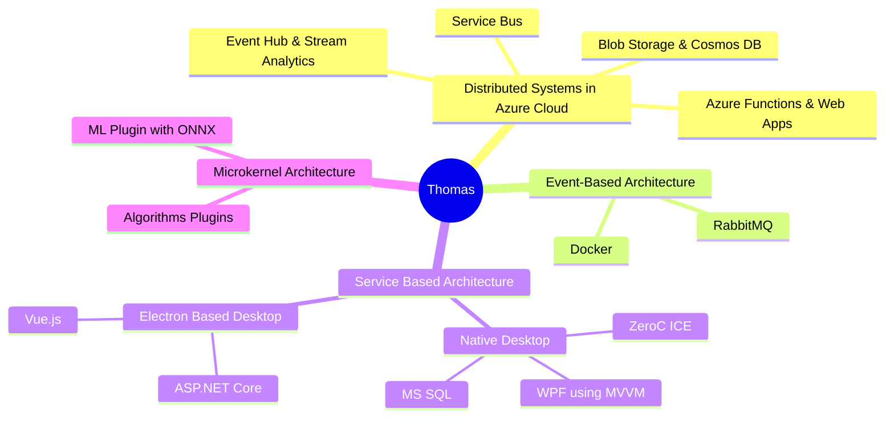

# Thomas Kägi

- **MSc ETH** in Mechanical Engineering
- 29\. June 1984
- I speak German and English fluently
- Swiss & British citizenship
- Speaker at Basel One 2022 on software quality

I have a nack for enabling people and boosting teams. Product quality will improve and your team members will shine if you add me to one (or many) of your projects. As such I thoroughly enjoy deep dives into hard problems, to then re-surface with a solution that *just works*. I preferably do that around .Net, but have proven to be capable on other stacks (python) as well. 
Thanks to my love for quality and my passion on design I consider myself a productive software engineer as well as a talented emerging architect.

In my position as *Subject Matter Expert Technical Quality* I promote engineering excellence by organising internal meetup events about technology and software engineering practices. This is a practice I enjoy taking with me on client projects.

Despite the shift to more abstract work I still love working as a software developer focussing on design and quality.

ToDo: Add GPG key

***Contact:*** [github](https://github.com/atmoos), [TEL & EMAIL], [linkedin](https://www.linkedin.com/in/thomas-k%C3%A4gi-46410a141/)

## Projects

Mostly, I've worked on projects revolving around the *.Net stack* and *git* repos. However, I am very comfortable switching technologies and/or stack, for instance to *python*. Also, I enjoy working for a broad variety of target environments and architectures, be those

- Plugin development as dynamically loadable libraries, for
  - *WPF* desktop engineering apps
  - medical instruments running customised Linux versions
  - including the use of [ONNX](https://onnx.ai/) ML models.
- Containerised event based architectures
  - *RabbitMQ* & *Docker*
- Distributed systems in the (*Azure*) cloud
  - *Event Hub*, *Service Bus*, *Stream Analytics*, *Blob Storage* & *Cosmos DB*
  - Azure *Web Apps* (*Angular*) and *Functions*
- *Electron* based desktop apps
  - *Vue.js* & *ASP.Net* (Core)
- Service Based Architectures for desktop apps
  - WPF, [ZeroC ICE](https://zeroc.com/ice) & *MS SQL* (2012)

**ToDo**: This mindmap doesn't really work...

### Subject Matter Expert - Manila, Philippines

3\.2023 - 2\.2024 @ *ERNI AG*, Manila, Philippines

***On architecture:*** High level cloud architectures ([C4)](https://c4model.com/) & heading an architecture book club.

Due to my track record of improving quality in projects, I was sent to our subsidiary in Manila as a cultural bridge and ambassador of quality. We chose to set a focus on improving processes revolving around sales activities.

Additionally, I lead the (technical) design phase of multiple solutions aimed at the local market as well as supporting the sales team during client visits in the Philippines and Singapore.

***Technology:*** Azure Cloud, .Net, Maui & Xamarin

### Tech Lead & Architect - Rotkreuz, Switzerland

10\.2021 - 2\.2023 @ *ERNI AG* for client in medical industry, Rotkreuz, Switzerland

***Architecture:*** Microkernel architecture embedded in an event-driven system.

As a tech lead and architect I was an integral part in implementing cutting edge diagnostic instrument workflows. Technical lead of a full stack team developing an electron maintenance app. Complete re-write of a generalised ML algorithm instrument plugin using [ONNX](https://onnx.ai/) model. Also, I designed and lead the sw-development of a new plugin for the newest diagnostic instrument.

***Technology:*** RabbitMQ, Docker, Asp.Net (core), electron, Vue.js, ONNX

### Architect - Rotkreuz, Switzerland

9\.2020 - 9\.2021 @ *ERNI AG*

***Architecture:*** Event based architecture with a broker topology

Supporting architect of an expert system cloud solution used to analyse and detect anomalies in the runtime data of various diagnostic instruments.

Lead a small team of developers implement new features. Analysed and fixed various performance bottlenecks caused by implementation mishaps through to non-optimal design.

***Technology:*** Azure Cloud, .Net, Asp.Net (core), Specflow, MSTest

### Tech Lead - Rotkreuz, Switzerland

10\.2019 - 8\.2020 @ *ERNI AG*

***Architecture:*** Embedded in an event driven (mediator) architecture, implemented based around a command pattern.

Developer and development architect on the service software component for a high precision med-tech instrument. Improvement of core components and features (cancellation), aiding the team in design decisions and leading team members technically. Drive and support the transition from WPF to WebApp.

***Technology:*** RabbitMQ, Docker, .Net, WPF, Specflow, MSTest

### Product Owner - Thun, Switzerland

10\.2018 - 4\.2019 @ *ERNI AG*

***Architecture:*** Service based translation layer.

I acted as co-designer and product owner for a project done in collaboration with a shoring team in in Bratislava. The service's primary task is to serve as a stateless translation layer (wrapper) for a COM API that is exposed as an XML based protocol.

***Technology:*** XML protocol over TCP/IP, COM API, .NET (core & Framework)

### SW-Engineer - Thun, Switzerland

3\.2018 - 3\.2019 @ *ERNI AG*

***Architecture:*** Layered test architecture.

Support the team transitioning form auto-generated, but brittle and slow end-to-end tests, to more stable BDD tests that reflected requirements.

I improved robustness of a partially built internal framework by eliminating crashes and false positives, as well as improving performance form 5h runtime down to 2h.

***Technology:*** Squish, Gherkin, python 3, Jenkins CI, SVN

### SW-Engineer - Stäfa, Switzerland

1\.2016 - 2\.2018 @ *Sensirion AG*

***Architecture:*** Event based architecture using the mediator topology,later evolving into microservices.

The core task was to build a control and monitoring software (desktop app) for a multi slot robotic sensor calibration system. Two unsuccessful attempts had been made previously. By decoupling components and simplifying designs and interfaces, my approach lead to success.

Tactics for success:

- Strict application of [SOLID](https://en.wikipedia.org/wiki/SOLID) principles
- Temporal and logical decoupling of processors
- Simplification of design, leading to:
  - New internally widely adopted command pattern implementation
  - Separately testable components

***Technology:*** .Net Framework, WPF, Beckhoff [PLC](https://en.wikipedia.org/wiki/Programmable_logic_controller), Sockets

### Mechanical Engineer - Zürich, Switzerland

1\.2015 - 6\.2015 @ *Rapyuta Robotics AG*

I began work there as one of the first employees. The main task was to integrate mechanical
components into their solution. Furthermore, I implemented the calibration algorithm and test
set-up used to parametrise transformation matrices used to compensate raw sensor data.
Other tasks included: Development of a test bed for electric propulsion motors, evaluation and
acquisition of electric motors and evaluation of suppliers for carbon fibre based components.

***Technology:*** python, C++, [ROS](https://www.ros.org/)

### Junior SW-Engineer - Stäfa, Switzerland

3\.2013 - 12\.2014 @ *Sensirion AG*

***Architecture:*** Layered architecture with RPC using ZeroC's ICE

My first job as a sw engineer. I designed a transparently parralelisable wrapper implementation of the RPC API targeting the firmware implementation of a calibration unit.

***Technology:*** .Net Framework, [ZeroC ICE](https://zeroc.com/ice)

### Practical Trainings

8\.2012 - 2\.2013 Internship @ Sensirion AG, Stäfa

8\.2000 - 8\.2004 Apprenticeship @ LCA Automation AG, Affoltern a.A.

## Consulting

Since May 2019 for *ERNI AG*

During my time at *ERNI AG* I was involved in numerous consulting mandates. These typically involve my capability of quickly analysing a situation on a high level, understanding the status quo, identifying areas of interest (typically issues) and then coming up with viable ideas and solutions for the next steps. This has worked well irrespective of the technologies involved.

- *ToDo*: Manila
- Architecting a UI test framework using [Squish](https://www.qt.io/product/quality-assurance/squish) by Qt for a cpp solution, **Rotkreuz**
  - The test framework was to be implemented using python
- Review and design extension of a solution based on a broker architecture, **Schlieren**
  - Workflow management system using [Camunda](https://camunda.com/)
  - The broker orchestrates interaction between Camunda workflows and python processor scripts
- Code review of
  - service based system with focus on performance, **Zürich**
  - monolithic Xamarin application with focus on quality, **Zürich**
- Knowledge transfer process set-up for a near shoring team, **Bratislava**
- XML code-gen solution review and PoC, **Zollikofen**

## Software Engineering Passion

I use my passion in software engineering to connect components and technologies in a robust and maintainable fashion. This is supported by my love of also connecting people and teams and their respective expertise.

### Architecture

- Projects at EPH
- Experience in the industry
- Leading through book club sessions at EPH on FoSA

I am familiar with following architectures:

### Software Engineering

- My team abilities
- Analytic skills
- Mention tools only in a side note and stress importance of "portability" and openness.
  - VSCode, Draw.io, .editorconfig, etc
  - Don't want a "locked in" situation
  - Developers know best how they are most productive

### My Own SWE Projects

I just love exploring new ideas and technology, which leads me to regularly embark on technological adventures. Out of these many projects, I'd like to mention on the project that is most mature: [Quantities](https://github.com/atmoos/Quantities).

ToDo: Expand

## Other Passions

- Avid sailor
- Dancer in training
- Keen traveller and hiker
- Baking sourdough bread
- Single board computers
  - [keeping nanosecond time](https://www.ntppool.org/scores/84.254.80.94)
  - [blocking adds](https://pi-hole.net/) on my home network
  - [providing VPN](https://www.wireguard.com/) services
