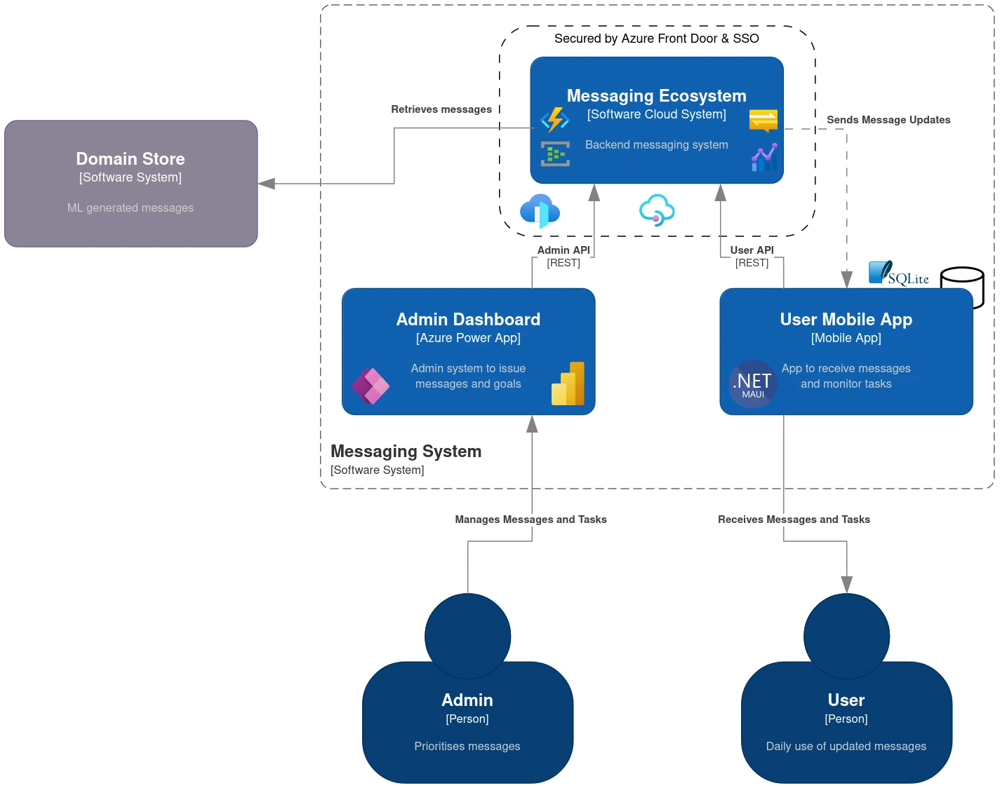
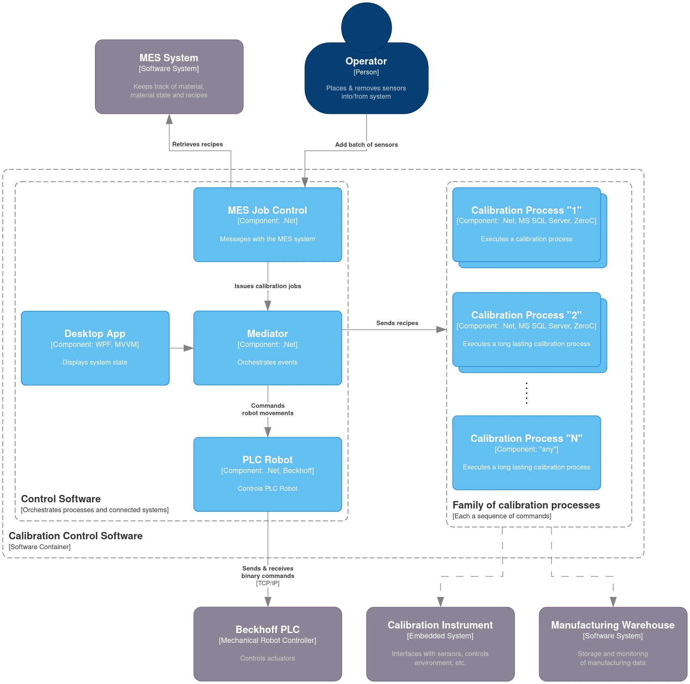

# Reference Architectures

This is a selection of architectures I was involved in. Either as an architect or lead developer.

## ᛟ Messaging System

Date: 2023  
Role: Architect

### Topology

Event based serverless messaging system.

This C4-Context Diagram was laid out by myself and the lead developer & project architect at the project start. He then further detailed the container diagram of the resulting ecosystem.

### Challenges

Thanks to our expert developers and outstanding team work the realisation of this system went very smoothly. The most interesting challenge occurred after the first deployment.

Every morning each user (out of many hundreds denoted $u$) receives on average $\mu$ ML generated messages out of a total of $m$ messages. It was required that each user receives the messages at the same time early in the morning. The initial implementation took about **two hours** to send all messages, clearly not meeting the requirements.  
After some careful inspection it was identified that the messaging dispersal "algorithms" was implemented in $\mathcal{O}(u \cdot \mu + m)$ time complexity and that the associated azure functions were running into timeouts.  
Careful analysis showed that some parts could be effectively panellised and, most importantly, the algorithm could be implemented as $\mathcal{O}(u + m)$.

This change doesn't seem that relevant. However, together with some improvements on concurrency it proved significant in that the average runtime was reduced to a mere **four seconds** when the improvement was deployed!

**Note**: This level of speed-up may indicate that there was more going on than "just" suboptimal complexity. I can no longer prove it, but there may have been some saturation in the service bus happening or scaling-out limits of Azure functions being reached.

## ᛟ Expert Cloud System

Date: 2021  
Role: Tech lead & supporting architect

## ᛟ Sensor Calibration System

Date: 2018  
Role: Architect & lead developer

### Topology

Event based architecture using a mediator topology. All communication is asynchronous and bi-directional.

Everything within the "Control Software" box was designed by myself. The calibration processes were designed by process engineers, where I chose to realise them using a very simple variation of the command pattern that I designed myself. However, I had a lot of help by a team member implementing the calibration processes.

#### Some Caveats

For historical reasons, this system had been developed as a monolith. Hence, the all the blue boxes really are C4-components. However after first deployment it was quickly realised that we'd be running into many of the issues associated with monoliths.  
I had prepared the system in such a way that it in principle could be broken apart and be separated out into C4-containers.

This was later achieved between one to two years later by my successor.

### Challenges

This system had been designed and implemented twice before I was given the task. Very briefly some of the chief design concerns I set out to solve:

- Improving structural connascence
  - Partitioning based on sub-domains
  - Temporal decoupling of all sub-domains
- Reducing the code complexity overall
- Improving robustness and reliability
  - This included such simple things as allowing cancellation
  - Well defined error behaviour
- Paving the way for a distributed system
